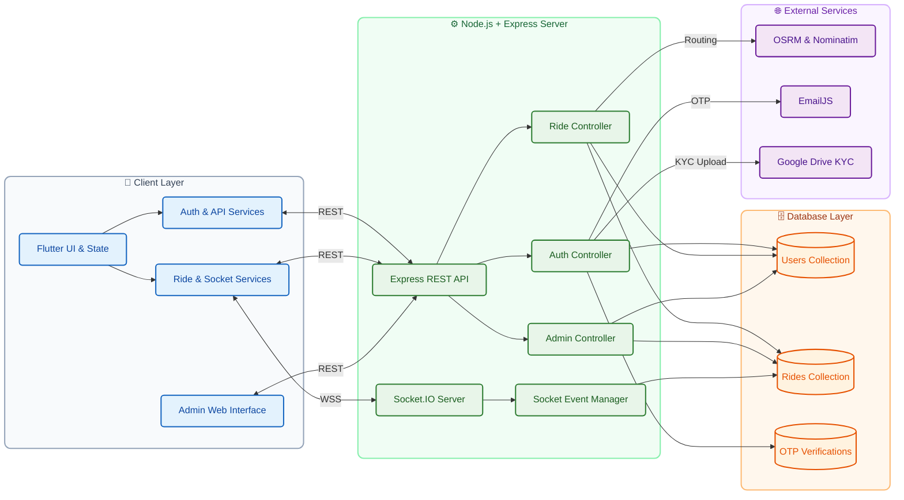

# System Architecture

```mermaid
graph LR
    %% Theming for Nodes
    classDef client fill:#E3F2FD,stroke:#1565C0,stroke-width:2px,color:#0D47A1,rx:5,ry:5
    classDef backend fill:#E8F5E9,stroke:#2E7D32,stroke-width:2px,color:#1B5E20,rx:5,ry:5
    classDef db fill:#FFF3E0,stroke:#E65100,stroke-width:2px,color:#E65100,rx:5,ry:5
    classDef external fill:#F3E5F5,stroke:#6A1B9A,stroke-width:2px,color:#4A148C,rx:5,ry:5

    %% Subgraph Styling to remove default yellow backgrounds
    style ClientLayer fill:#f8fafc,stroke:#94a3b8,stroke-width:2px,color:#334155,rx:10,ry:10
    style BackendLayer fill:#f0fdf4,stroke:#86efac,stroke-width:2px,color:#166534,rx:10,ry:10
    style DataLayer fill:#fff7ed,stroke:#fdba74,stroke-width:2px,color:#9a3412,rx:10,ry:10
    style ExternalLayer fill:#faf5ff,stroke:#d8b4fe,stroke-width:2px,color:#6b21a8,rx:10,ry:10

    subgraph ClientLayer [📱 Client Layer]
        UI[Flutter UI & State]
        AuthSvc[Auth & API Services]
        RideSvc[Ride & Socket Services]
        Admin[Admin Web Interface]
    end

    subgraph BackendLayer [⚙️ Node.js + Express Server]
        API[Express REST API]
        WSS[Socket.IO Server]
        
        AuthCtrl[Auth Controller]
        RideCtrl[Ride Controller]
        AdminCtrl[Admin Controller]
        
        SocketMgr[Socket Event Manager]
    end

    subgraph DataLayer [🗄️ Database Layer]
        UserMod[(Users Collection)]
        RideMod[(Rides Collection)]
        OTPMod[(OTP Verifications)]
    end

    subgraph ExternalLayer [🌐 External Services]
        Maps[OSRM & Nominatim]
        SMTP[EmailJS]
        Drive[Google Drive KYC]
    end

    %% Wiring Client Layer Internals
    UI --> AuthSvc
    UI --> RideSvc

    %% Wiring Client to Backend
    AuthSvc <-->|REST| API
    RideSvc <-->|REST| API
    RideSvc <-->|WSS| WSS
    Admin <-->|REST| API

    %% Wiring Backend Internals
    API --> AuthCtrl
    API --> RideCtrl
    API --> AdminCtrl
    WSS --> SocketMgr

    %% Wiring Backend to DB
    AuthCtrl --> UserMod
    AuthCtrl --> OTPMod
    
    RideCtrl --> RideMod
    RideCtrl --> UserMod
    
    AdminCtrl --> UserMod
    AdminCtrl --> RideMod

    SocketMgr --> RideMod

    %% Wiring Backend to External
    RideCtrl -->|Routing| Maps
    AuthCtrl -->|OTP| SMTP
    AuthCtrl -->|KYC Upload| Drive

    %% Apply Classes
    class UI,AuthSvc,RideSvc,Admin client;
    class API,WSS,AuthCtrl,RideCtrl,AdminCtrl,SocketMgr backend;
    class UserMod,RideMod,OTPMod db;
    class Maps,SMTP,Drive external;
```
