<div align="center">
  
  
  # 🚗 Ridify

  ### **Real-time ride-sharing, reimagined for students.**  
  *Offer a seat, find a ride, track it live, and split the cost — all in one seamless experience.*

  [](LICENSE)
  [](https://flutter.dev)
  [](https://nodejs.org)
  [](https://mongodb.com)
  [](https://socket.io)
</div>

---

## 🚀 Key Features

Ridify is designed to make commuting easier, safer, and more social. Here’s what makes it stand out:

- 🚘 **Flexible Ride Offering** — Post journeys with custom vehicle types, available seats, and transparent fares.
- 🔍 **Smart Ride Discovery** — Find the perfect ride based on your location, schedule, and vehicle preference.
- ⚡ **Instant Matching** — Connect with drivers and passengers instantly via real-time Socket.IO events.
- 🗺️ **Live Map Tracking** — Watch your ride approach in real-time with integrated OpenStreetMap & GPS tracking.
- 💬 **Integrated Group Chat** — Coordinate pickup details and socialize with your ride group before and during the journey.
- 💰 **Financial Dashboard** — Track your total earnings as a driver or your savings as a passenger at a glance.
- 🛡️ **Admin Suite** — Robust management tools for data cleanup and user moderation, protected by secure middleware.

---

## 🛠️ Tech Stack

| Layer | Technology |
|---|---|
| **Mobile App** | **Flutter (Dart)** — Cross-platform experience with `shared_preferences` persistence |
| **Backend API** | **Node.js & Express.js** — High-performance RESTful architecture |
| **Real-time Engine** | **Socket.IO** — Bidirectional low-latency communication for tracking and chat |
| **Database** | **MongoDB Atlas** — Scalable NoSQL storage with Mongoose ODM |
| **Maps & Tracking** | **OpenStreetMap & OSRM** — Seamless live location tracking and routing |
| **Security** | **Bcrypt** — Industry-standard password hashing (10 salt rounds) |

---

## 🔐 Security & Authentication

We believe security shouldn't compromise simplicity:

- **Bcrypt Hashing** — Every password is cryptographically hashed using salting. Plain-text is never stored in the database.
- **Secure Email Auth** — Strict validation on both client and server ensures only legitimate accounts are created.
- **Persistent Sessions** — A frictionless login experience that remembers you securely across app restarts.
- **Admin Shield** — Critical data management routes are protected by role-based access control (RBAC) middleware.

---

## 📸 Experience Ridify

> *A complete walkthrough of the Ridify ecosystem, featuring 20 unique states across the Passenger and Driver journeys, live routing, and real-time data sync.*

### 🚪 Authentication & User Hub
<table>
  <tr>
    <th width="50%">Login & Registration</th>
    <th width="50%">Profile & History</th>
  </tr>
  <tr>
    <td valign="top" align="center">
      <b>Login</b><br>
      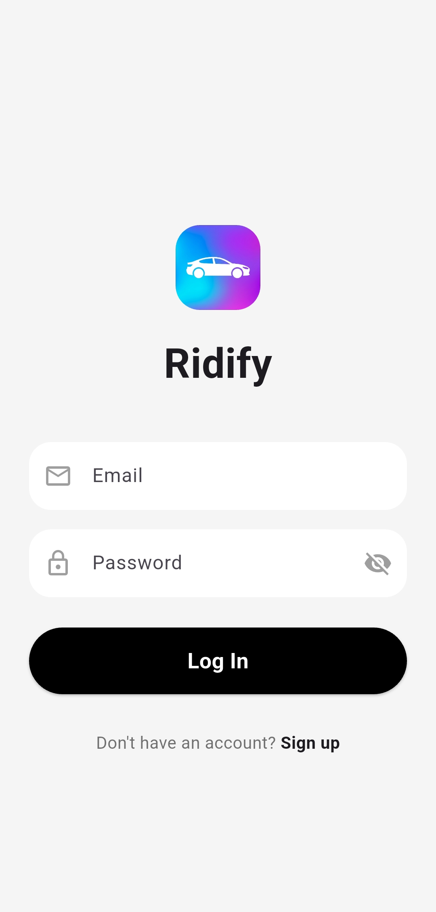
    </td>
    <td valign="top" align="center">
      <b>Signup</b><br>
      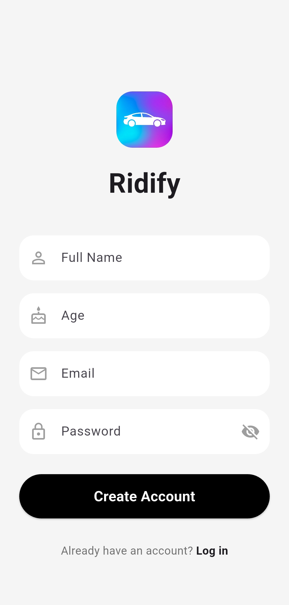
    </td>
  </tr>
  <tr>
    <td valign="top" align="center">
      <b>User Profile</b><br>
      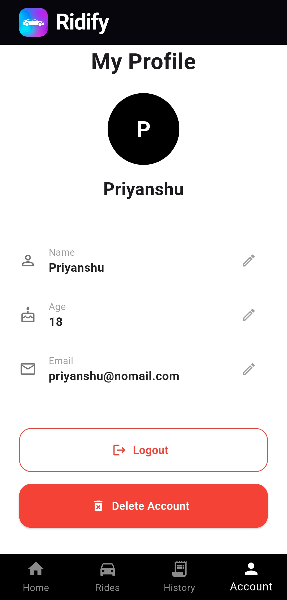
    </td>
    <td valign="top" align="center">
      <b>Ride History</b><br>
      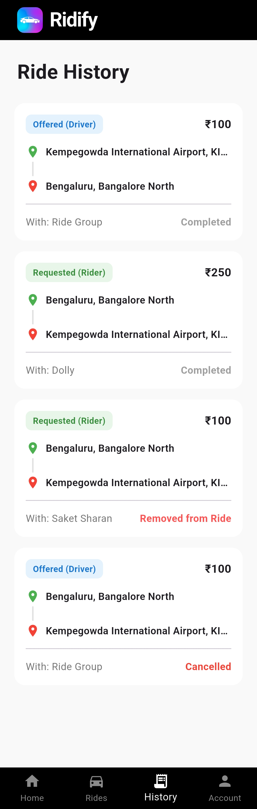
    </td>
  </tr>
</table>

### 💰 Dynamic Dashboards
<table>
  <tr>
    <th width="50%">Initial State</th>
    <th width="50%">Active State</th>
  </tr>
  <tr>
    <td valign="top" align="center">
      <b>New Dashboard</b><br>
      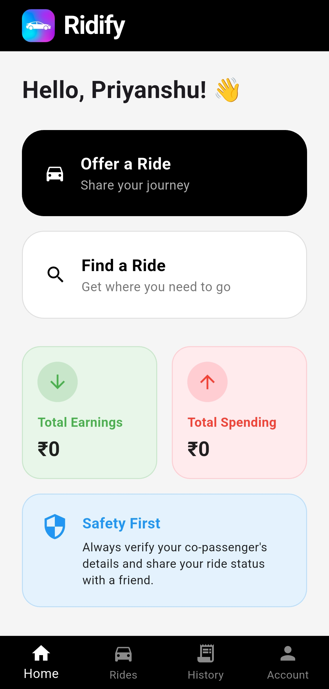
    </td>
    <td valign="top" align="center">
      <b>Earnings & Spending</b><br>
      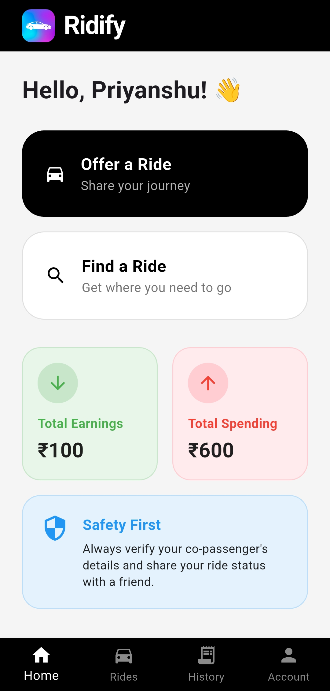
    </td>
  </tr>
</table>

### 🚘 The Marketplace
<table>
  <tr>
    <th width="50%">Passenger Search</th>
    <th width="50%">Driver Hosting</th>
  </tr>
  <tr>
    <td valign="top" align="center">
      <b>Search Form</b><br>
      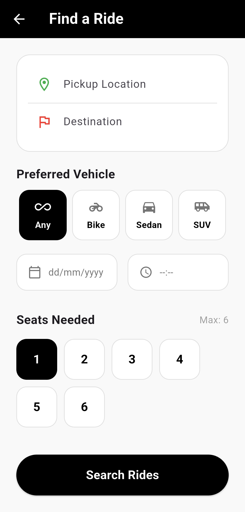
    </td>
    <td valign="top" align="center">
      <b>Create Listing</b><br>
      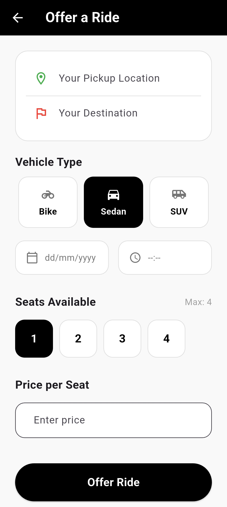
    </td>
  </tr>
  <tr>
    <td valign="top" align="center">
      <b>Available Rides</b><br>
      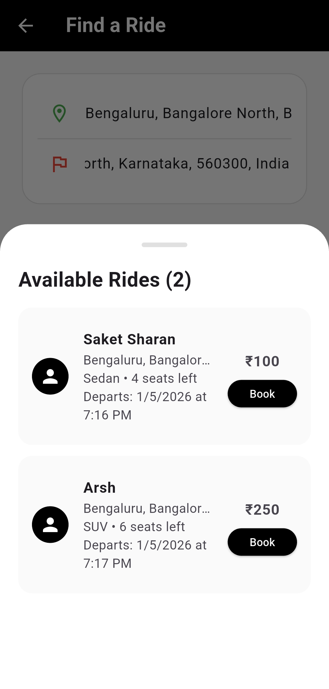
    </td>
    <td valign="top" align="center">
      <b>Driver Match Requests</b><br>
      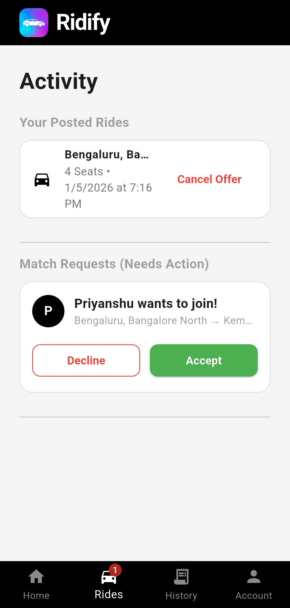
    </td>
  </tr>
  <tr>
    <td valign="top" align="center">
      <b>Request Processing</b><br>
      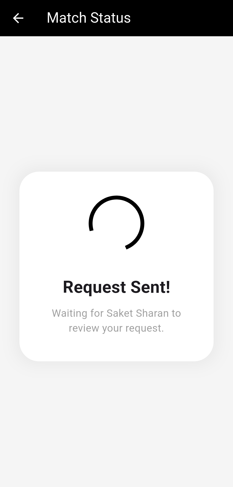
    </td>
    <td valign="top" align="center">
      <b>Ongoing Activity</b><br>
      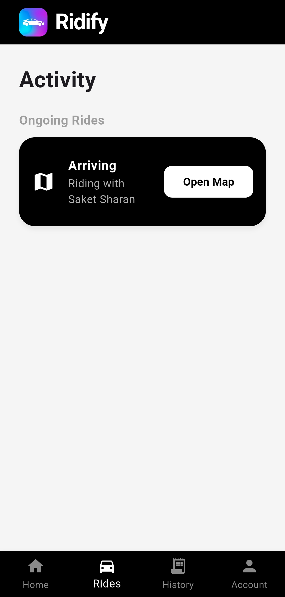
    </td>
  </tr>
</table>

### 📱 Live Journey: Passenger Perspective
<table>
  <tr>
    <th width="50%">Approaching</th>
    <th width="50%">Boarded</th>
  </tr>
  <tr>
    <td valign="top" align="center">
      <b>Driver Arriving</b><br>
      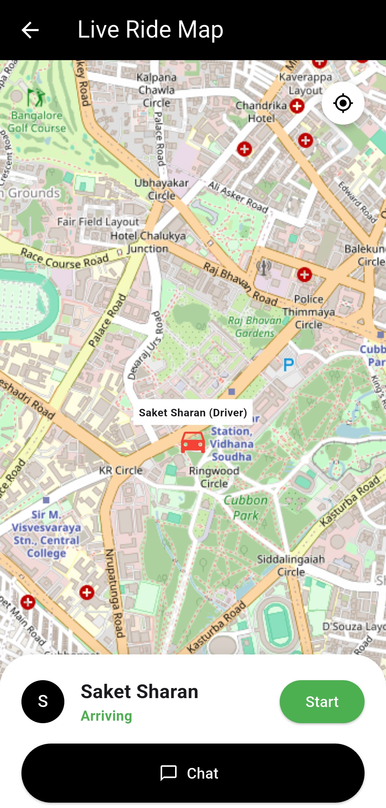
    </td>
    <td valign="top" align="center">
      <b>You're In!</b><br>
      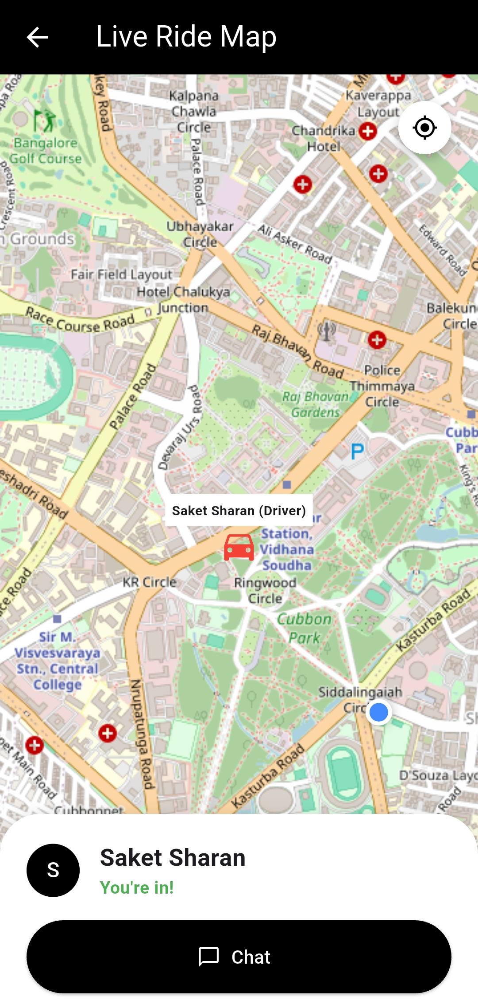
    </td>
  </tr>
</table>

### 🚗 Live Journey: Driver Perspective & Chat
<table>
  <tr>
    <th width="50%">Route Management</th>
    <th width="50%">Communication</th>
  </tr>
  <tr>
    <td valign="top" align="center">
      <b>Waiting for Passengers</b><br>
      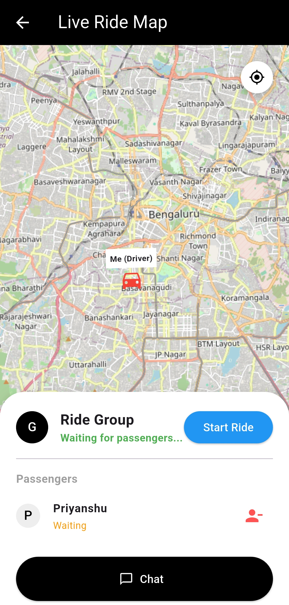
    </td>
    <td valign="top" align="center">
      <b>Ride In Progress</b><br>
      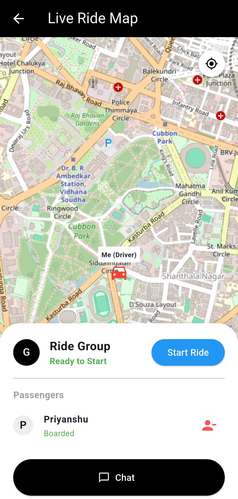
    </td>
  </tr>
  <tr>
    <td valign="top" align="center">
      <b>Ready to End</b><br>
      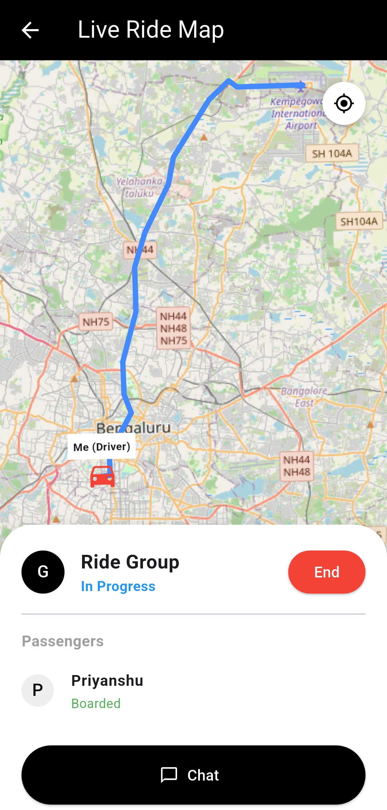
    </td>
    <td valign="top" align="center">
      <b>Socket.IO Live Chat</b><br>
      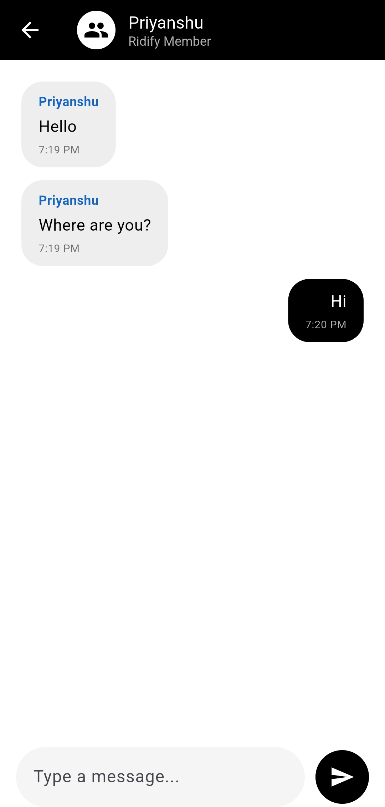
    </td>
  </tr>
</table>

### 🏁 Ride Completion
<table>
  <tr>
    <th width="50%">Driver Success</th>
    <th width="50%">Passenger Success</th>
  </tr>
  <tr>
    <td valign="top" align="center">
      <b>Driver Completion</b><br>
      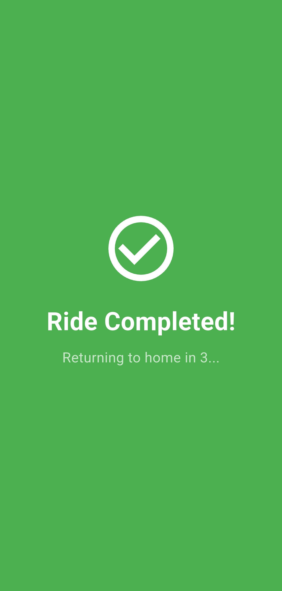
    </td>
    <td valign="top" align="center">
      <b>Rider Completion</b><br>
      
    </td>
  </tr>
</table>

---

## ⚙️ Installation & Setup

### 📦 Prerequisites
* **Flutter SDK** (`^3.x`)
* **Node.js** (`^18.x`)
* **MongoDB Atlas** connection string

### 🖥️ Backend Setup
```bash
# Navigate to backend directory
cd backend

# Create your environment file
cp .env.example .env   # Update with your MONGO_URI and ADMIN_EMAILS

# Install dependencies and start
npm install
npm start
```

### 📱 Frontend Setup
```bash
# Navigate to frontend directory
cd frontend

# Create your environment file
cp .env.example .env   # Update with your BACKEND_URL and ADMIN_EMAIL

# Install Flutter dependencies
flutter pub get

# Launch the app
flutter run
```

---

## 📄 License
This project is licensed under the **MIT License**. See the [LICENSE](LICENSE) file for details.

## 👤 Author
**Priyanshu Sharan**  
[](https://github.com/priyanshusharan-cmd)

<div align="center">
  <sub>Built with ❤️ as a real-world solution for student mobility.</sub>
</div>
