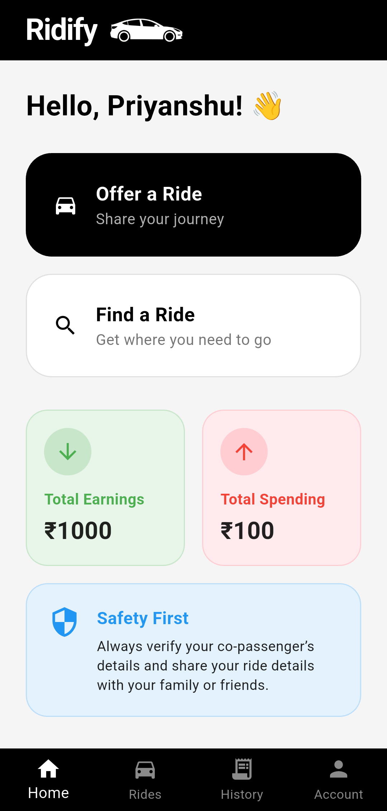
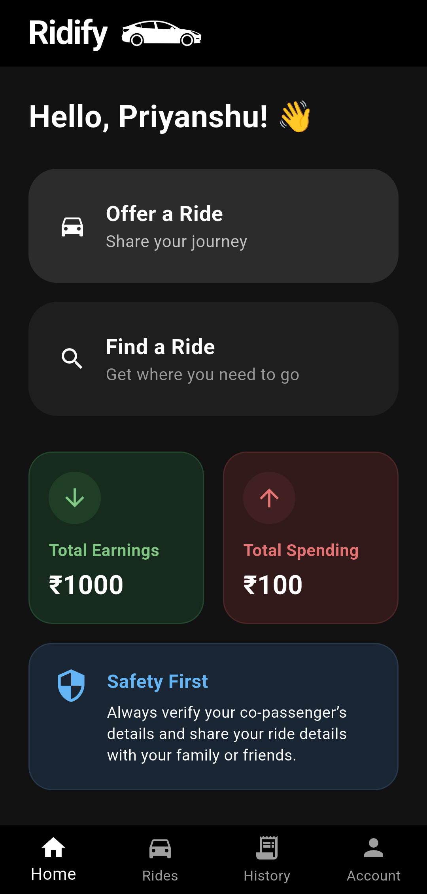

<h1 align="center">
  
  <br>
  Ridify
</h1>

<p align="center">
  <b>A real-time ride-sharing app for students. Offer or find shared rides, track journeys live on a map, and split travel costs effortlessly.</b>
</p>

<p align="center">
  
  
  
  
  
</p>

<hr>

## ✨ Key Features

* **🚗 Ride Matching:** Easily offer rides if you have a vehicle or find rides if you need a lift.
* **📍 Real-Time Tracking:** Watch the driver approach on the map with real-time location updates using WebSocket connections.
* **💬 In-App Chat:** Connect securely with your driver or passengers without sharing phone numbers.
* **🛡️ Admin Dashboard:** Comprehensive admin panel for user verification, ride management, and monitoring.
* **🌗 Dark & Light Mode:** Completely responsive theme adapting to your device's settings seamlessly.
* **🔐 Secure Authentication:** OTP-based login and email verification for students.

---

## 📸 App Showcase

### 🏠 Main Flows
| Home Screen | Find Ride | Offer Ride | Available Rides |
|:---:|:---:|:---:|:---:|
|  |  |  |  |
|  |  |  |  |

### 🗺️ Live Tracking & Communication
| Live Tracking (Driver) | Live Tracking (Rider) | Live Chat | Location Picker |
|:---:|:---:|:---:|:---:|
|  |  |  |  |
|  |  |  |  |

### ⚙️ Admin & Extras
| Admin Dashboard | Admin Verify Users | Admin Active Rides | User Profile |
|:---:|:---:|:---:|:---:|
|  |  |  |  |
|  |  |  |  |

---

## 🛠️ Technology Stack

### **Frontend (Mobile App)**
* **Framework:** [Flutter](https://flutter.dev/) (Dart)
* **State Management:** Provider
* **Mapping:** flutter_map, latlong2
* **Real-time Engine:** socket_io_client
* **Storage:** shared_preferences, flutter_secure_storage

### **Backend (API Server)**
* **Runtime:** [Node.js](https://nodejs.org/)
* **Framework:** Express.js
* **Database:** MongoDB with Mongoose
* **Real-time Engine:** Socket.IO
* **Security:** JWT Authentication, bcrypt, helmet, express-rate-limit
* **Geospatial:** Turf.js

---

## 🚀 Getting Started

### Prerequisites
* [Flutter SDK](https://flutter.dev/docs/get-started/install) (v3.11.4+)
* [Node.js](https://nodejs.org/en/) (v16.x or later)
* [MongoDB](https://www.mongodb.com/) (Local or Atlas cluster)

### 1. Backend Setup
```bash
# Navigate to the backend directory
cd backend

# Install dependencies
npm install

# Setup environment variables
cp .env.example .env
# Edit .env with your MongoDB URI, JWT Secret, etc.

# Start the development server
npm run dev
```

### 2. Frontend Setup
```bash
# Navigate to the frontend directory
cd frontend

# Install Flutter packages
flutter pub get

# Setup environment variables
cp .env.example .env
# Edit .env with your backend API URL (e.g., http://localhost:5000)

# Run the app
flutter run
```

---

## 🤝 Contributing

Contributions, issues, and feature requests are welcome! Feel free to check the issues page.

## 📝 License

This project is licensed under the MIT License - see the [LICENSE](LICENSE) file for details.

<p align="center">
  <i>Developed with ❤️ by Priyanshu Sharan.</i>
</p>
