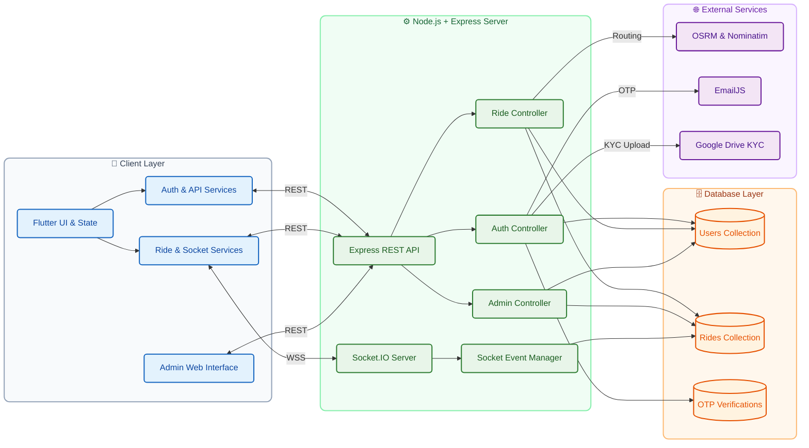

<div align="center">


# Ridify

### Real-time peer-to-peer ride-sharing & cost-splitting — built for everyone.

[](https://flutter.dev)
[](https://dart.dev)
[](https://nodejs.org)
[](https://expressjs.com)
[](https://www.mongodb.com)
[](https://socket.io)
[](LICENSE)

</div>

---

## Overview

Ridify is a **production-grade, real-time ride-sharing and cost-splitting application** that connects drivers and riders for shared journeys. With live map tracking, instant in-app messaging, transparent fare splitting, and a dedicated admin moderation layer, Ridify delivers a complete end-to-end mobility experience — from OTP-verified sign-up to trip completion.

Built with Flutter for mobile and Node.js + Express + MongoDB on the backend, Ridify features JWT authentication with silent refresh, Socket.IO-powered real-time updates, OpenStreetMap routing via OSRM, and a sweep-line capacity algorithm for optimal ride matching.

---

## ✨ Key Features

| Feature | Description |
|---|---|
| 🔐 **Secure Auth** | OTP-verified email sign-up, SHA-256 hashed OTPs, JWT + refresh token rotation |
| 🗺️ **Live Tracking** | Real-time driver and rider positions on an interactive flutter_map + OpenStreetMap |
| 🚗 **Ride Lifecycle** | Full state machine: `scheduled → started → boarding → inTransit → completed` |
| 💬 **In-app Chat** | Per-ride Socket.IO messaging between driver and all co-passengers |
| 💰 **Cost Splitting** | Automated fare calculation and equal cost-split across all confirmed riders |
| 🔍 **Smart Matching** | Sweep-line geometry algorithm for pickup/dropoff proximity matching |
| 👤 **KYC Verification** | Document upload via Google Drive integration with admin-side review |
| 🛡️ **Admin Panel** | Full user/ride management, ban controls, live ride monitoring, and stats dashboard |
| ⚡ **Real-time Events** | Ride requests, acceptances, boarding, drop-off, and chat — all over WebSocket |
| 🔒 **Production Security** | Helmet, rate limiting, input sanitisation, CORS locking, and optimistic locking |

---

## 🛠️ Tech Stack

### Frontend

| Technology | Purpose |
|---|---|
| Flutter | Cross-platform mobile UI framework |
| Dart | Application language |
| Provider | Reactive state management |
| socket_io_client | WebSocket real-time communication |
| flutter_map | Interactive OpenStreetMap integration |
| geolocator | Device GPS & location permissions |
| flutter_secure_storage | Encrypted JWT token storage |
| http | REST API client |

### Backend

| Technology | Purpose |
|---|---|
| Node.js | Runtime environment |
| Express | HTTP framework |
| MongoDB | Primary database |
| Mongoose | ODM / schema validation |
| Socket.IO | Bidirectional real-time events |
| JSON Web Token | Authentication & authorisation |
| bcrypt | Password hashing |
| @turf/turf | Geospatial sweep-line calculations |
| Winston | Structured logging |
| Helmet | HTTP security headers |
| express-rate-limit | API abuse prevention |
| sanitize-html | XSS input sanitisation |

### External Services

| Service | Purpose |
|---|---|
| EmailJS | OTP & transactional email delivery |
| OSRM | Open-source route calculation engine |
| Nominatim | Geocoding and reverse geocoding |
| Google Apps Script | KYC document upload to Google Drive |

---

## 🏗️ System Architecture


```mermaid
graph LR
    %% Theming for Nodes
    classDef client fill:#E3F2FD,stroke:#1565C0,stroke-width:2px,color:#0D47A1,rx:5,ry:5
    classDef backend fill:#E8F5E9,stroke:#2E7D32,stroke-width:2px,color:#1B5E20,rx:5,ry:5
    classDef db fill:#FFF3E0,stroke:#E65100,stroke-width:2px,color:#E65100,rx:5,ry:5
    classDef external fill:#F3E5F5,stroke:#6A1B9A,stroke-width:2px,color:#4A148C,rx:5,ry:5

    %% Subgraph Styling to remove default yellow backgrounds
    style ClientLayer fill:#f8fafc,stroke:#94a3b8,stroke-width:2px,color:#334155,rx:10,ry:10
    style BackendLayer fill:#f0fdf4,stroke:#86efac,stroke-width:2px,color:#166534,rx:10,ry:10
    style DataLayer fill:#fff7ed,stroke:#fdba74,stroke-width:2px,color:#9a3412,rx:10,ry:10
    style ExternalLayer fill:#faf5ff,stroke:#d8b4fe,stroke-width:2px,color:#6b21a8,rx:10,ry:10

    subgraph ClientLayer [📱 Client Layer]
        UI[Flutter UI & State]
        AuthSvc[Auth & API Services]
        RideSvc[Ride & Socket Services]
        Admin[Admin Web Interface]
    end

    subgraph BackendLayer [⚙️ Node.js + Express Server]
        API[Express REST API]
        WSS[Socket.IO Server]
        
        AuthCtrl[Auth Controller]
        RideCtrl[Ride Controller]
        AdminCtrl[Admin Controller]
        
        SocketMgr[Socket Event Manager]
    end

    subgraph DataLayer [🗄️ Database Layer]
        UserMod[(Users Collection)]
        RideMod[(Rides Collection)]
        OTPMod[(OTP Verifications)]
    end

    subgraph ExternalLayer [🌐 External Services]
        Maps[OSRM & Nominatim]
        SMTP[EmailJS]
        Drive[Google Drive KYC]
    end

    %% Wiring Client Layer Internals
    UI --> AuthSvc
    UI --> RideSvc

    %% Wiring Client to Backend
    AuthSvc <-->|REST| API
    RideSvc <-->|REST| API
    RideSvc <-->|WSS| WSS
    Admin <-->|REST| API

    %% Wiring Backend Internals
    API --> AuthCtrl
    API --> RideCtrl
    API --> AdminCtrl
    WSS --> SocketMgr

    %% Wiring Backend to DB
    AuthCtrl --> UserMod
    AuthCtrl --> OTPMod
    
    RideCtrl --> RideMod
    RideCtrl --> UserMod
    
    AdminCtrl --> UserMod
    AdminCtrl --> RideMod

    SocketMgr --> RideMod

    %% Wiring Backend to External
    RideCtrl -->|Routing| Maps
    AuthCtrl -->|OTP| SMTP
    AuthCtrl -->|KYC Upload| Drive

    %% Apply Classes
    class UI,AuthSvc,RideSvc,Admin client;
    class API,WSS,AuthCtrl,RideCtrl,AdminCtrl,SocketMgr backend;
    class UserMod,RideMod,OTPMod db;
    class Maps,SMTP,Drive external;
```

---

## 🚀 Installation & Setup

### Prerequisites

- **Node.js** v20 or higher
- **npm** v9 or higher
- **Flutter SDK** 3.x — [Flutter install guide](https://docs.flutter.dev/get-started/install)
- **MongoDB** 7.x — local instance or [MongoDB Atlas](https://www.mongodb.com/atlas)
- **Android** device or emulator (iOS support planned)

---

### 1. Clone the Repository

```bash
git clone https://github.com/priyanshusharan-cmd/ridify.git
cd ridify
```

---

### 2. Backend Setup

```bash
cd backend
npm install
cp .env.example .env
# Fill in your .env values — see the Environment Variables section below
node server.js
```

The server starts on `http://localhost:3000` by default.

---

### 3. Frontend Setup

```bash
cd frontend
flutter pub get
```

Create a `.env` file in the `frontend/` directory:

```env
BASE_URL=http://10.0.2.2:3000     # Android emulator pointing to host localhost
# BASE_URL=http://<your-lan-ip>:3000  # Physical device on the same network
```

Run the app:

```bash
flutter run
```

---

## 🔧 Environment Variables

Copy `backend/.env.example` to `backend/.env` and fill in each value.

### Server

| Variable | Description | Example |
|---|---|---|
| `PORT` | HTTP server port | `3000` |
| `NODE_ENV` | Runtime environment | `development` |
| `ALLOWED_ORIGINS` | CORS whitelist (comma-separated) | `http://localhost:3000` |

### Database

| Variable | Description | Example |
|---|---|---|
| `MONGODB_URI` | MongoDB connection string | `mongodb://localhost:27017/ridify` |

### Authentication

| Variable | Description | How to Generate |
|---|---|---|
| `JWT_SECRET` | Access token signing secret | `node -e "console.log(require('crypto').randomBytes(64).toString('hex'))"` |
| `JWT_REFRESH_SECRET` | Refresh token signing secret | `node -e "console.log(require('crypto').randomBytes(64).toString('hex'))"` |
| `JWT_EXPIRY` | Access token TTL | `15m` |
| `JWT_REFRESH_EXPIRY` | Refresh token TTL | `7d` |

### Email (EmailJS)

| Variable | Description |
|---|---|
| `EMAILJS_SERVICE_ID` | Your EmailJS service ID |
| `EMAILJS_TEMPLATE_ID` | OTP email template ID |
| `EMAILJS_PUBLIC_KEY` | EmailJS public API key |
| `EMAILJS_PRIVATE_KEY` | EmailJS private API key |

### KYC Storage (Google Apps Script)

| Variable | Description |
|---|---|
| `GOOGLE_SCRIPT_URL` | Deployed Apps Script web app URL |

### Routing (OSRM)

| Variable | Description | Default |
|---|---|---|
| `OSRM_URL` | OSRM instance base URL | `http://router.project-osrm.org` |

---

## 📸 Screenshots

<details>
<summary><strong>🎬 Onboarding & Auth</strong></summary>

<br>

#### Splash Screen

| Light | Dark |
|:---:|:---:|
|  |  |

<br><br>

#### Login

| Light | Dark |
|:---:|:---:|
|  |  |

<br><br>

#### Sign Up

| Light | Dark |
|:---:|:---:|
|  |  |

<br><br>

</details>

<details>
<summary><strong>🏠 Home & Ride Discovery</strong></summary>

<br>

#### Home Screen

| Light | Dark |
|:---:|:---:|
|  |  |

<br><br>

#### Offer a Ride

| Light | Dark |
|:---:|:---:|
|  |  |

<br><br>

#### Location Picker

| Light | Dark |
|:---:|:---:|
|  |  |

<br><br>

#### Find a Ride

| Light | Dark |
|:---:|:---:|
|  |  |

<br><br>

#### Available Rides

| Light | Dark |
|:---:|:---:|
|  |  |

<br><br>

#### Filters

| Light | Dark |
|:---:|:---:|
|  |  |

<br><br>

</details>

<details>
<summary><strong>📋 Activity & Ride Details</strong></summary>

<br>

#### Activity Screen

| Light | Dark |
|:---:|:---:|
|  |  |

<br><br>

#### Ride Details

| Light | Dark |
|:---:|:---:|
|  |  |

<br><br>

</details>

<details>
<summary><strong>🚦 Live Ride Tracking</strong></summary>

<br>

#### Driver — Ride Started

| Light | Dark |
|:---:|:---:|
|  |  |

<br><br>

#### Rider — Waiting for Pickup

| Light | Dark |
|:---:|:---:|
|  |  |

<br><br>

#### Driver — At Boarding Point

| Light | Dark |
|:---:|:---:|
|  |  |

<br><br>

#### Rider — Driver Arrived

| Light | Dark |
|:---:|:---:|
|  |  |

<br><br>

#### Driver — Rider Boarded

| Light | Dark |
|:---:|:---:|
|  |  |

<br><br>

#### Rider — In Transit

| Light | Dark |
|:---:|:---:|
|  |  |

<br><br>

#### In-app Chat

| Light | Dark |
|:---:|:---:|
|  |  |

<br><br>

#### Driver — Trip Complete

| Light | Dark |
|:---:|:---:|
|  |  |

<br><br>

#### Rider — Trip Complete

| Light | Dark |
|:---:|:---:|
|  |  |

<br><br>

</details>

<details>
<summary><strong>📜 History & Profile</strong></summary>

<br>

#### Ride History

| Light | Dark |
|:---:|:---:|
|  |  |

<br><br>

#### Co-Passengers

| Light | Dark |
|:---:|:---:|
|  |  |

<br><br>

#### Profile

| Light | Dark |
|:---:|:---:|
|  |  |

<br><br>

</details>

<details>
<summary><strong>🛡️ Admin Panel</strong></summary>

<br>

#### Admin Dashboard

| Light | Dark |
|:---:|:---:|
|  |  |

<br><br>

#### Admin — Users

| Light | Dark |
|:---:|:---:|
|  |  |

<br><br>

#### Admin — User Actions

| Light | Dark |
|:---:|:---:|
|  |  |

<br><br>

#### Admin — Active Rides

| Light | Dark |
|:---:|:---:|
|  |  |

<br><br>

#### Admin — KYC Verification

| Light | Dark |
|:---:|:---:|
|  |  |

<br><br>

</details>

---


## 📄 License

This project is licensed under the **MIT License** — see the [LICENSE](LICENSE) file for details.

---

<div align="center">
Crafted with ❤️ by Priyanshu Sharan<br>
<a href="https://www.linkedin.com/in/priyanshusharan/"></a>
</div>
